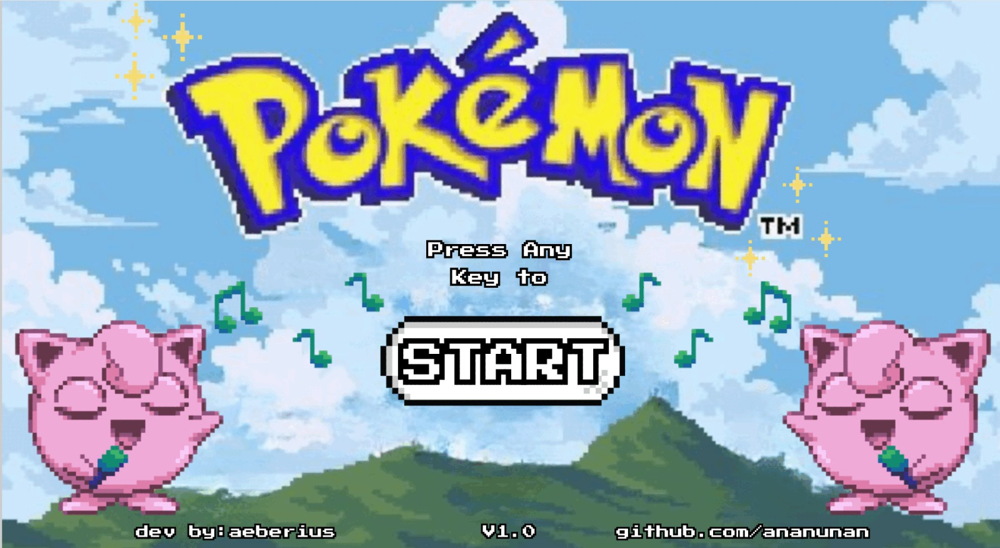
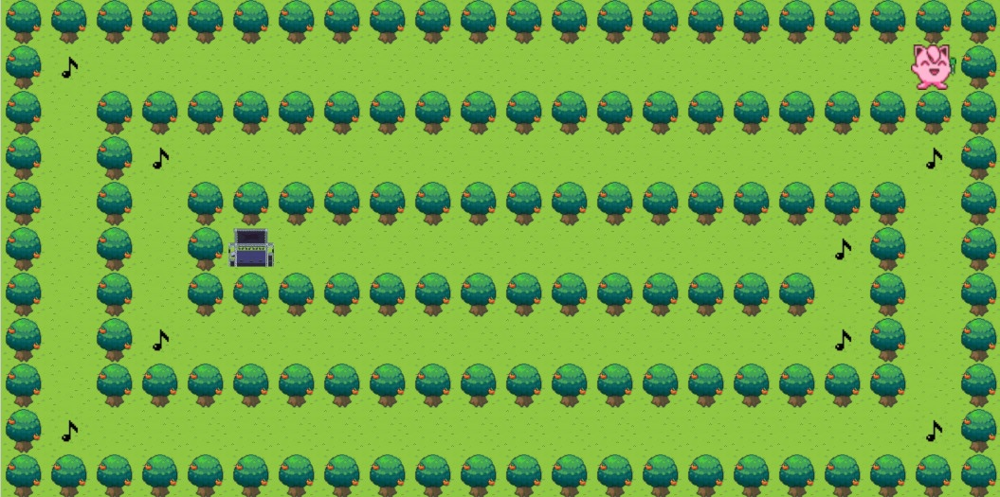
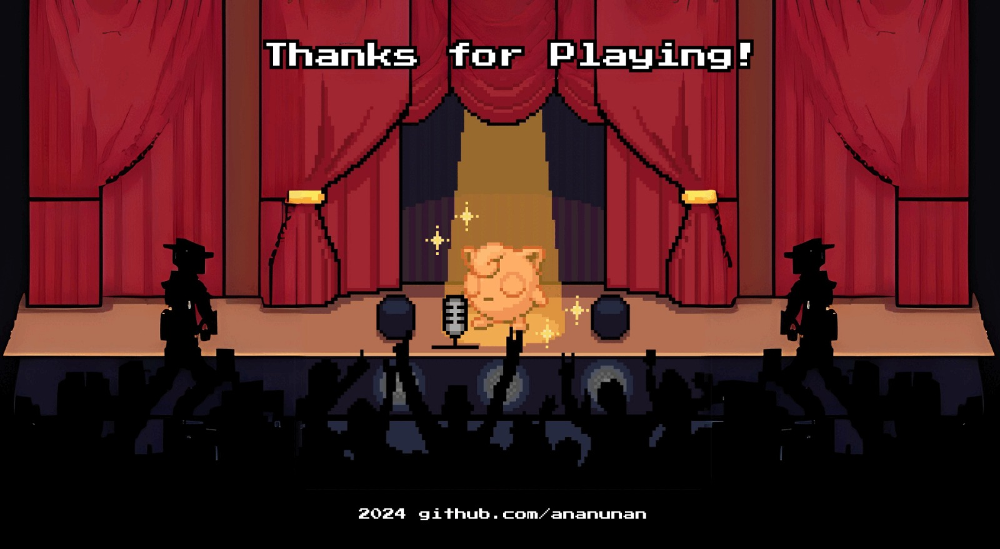

# So_Long: 🎤💖Let’s help Jigglypuff bring her concert to life! 🎤💖

Step into the world of `So_Long`, a delightful game starring **Jigglypuff** on a quest to gather music notes and reach the stage for her grand performance! 🎤✨ 

Will you guide Jigglypuff through the maze and help her shine under the spotlight? Let’s hit the high notes together! 🎵  

---
## 🎮 Gameplay 

### Start Screen  
  
---
### Gameplay Screen
  
---
### Final Screen
  
---

## 🌟 **Game Overview**

Jigglypuff is preparing for her biggest concert yet, but all her musical notes are scattered across a tricky maze!  
Your mission is to:
- **Collect all the musical notes (🎵)** hidden in the maze.  
- Avoid obstacles and enemies trying to silence Jigglypuff's performance.  
- Reach the stage (🎭) and let Jigglypuff steal the show!  

It’s not just a game—it’s a performance waiting to happen! 🌟  

---

## 🎮 **How to Play**

1. **Clone the repository**:  
   ```bash
   git clone https://github.com/ananunan/So_Long.git
   cd So_Long
2. **Compile the game**:
   ```bash
   make
3. **Run the game**:
   ```bash
   ./so_long <map_file.ber>
4. Control Jigglypuff:

Use the arrow keys or WASD to guide her through the maze.

Collect all the musical notes (🎵) before heading to the stage (🎭).

## 🛠️ Key Features

🎤 Musical Journey:
Immerse yourself in Jigglypuff's quest to recover her lost notes and make it to the performance of a lifetime.

🎨 Custom Maps:
Create your own concert challenges! Build custom .ber maps to design unique mazes filled with twists, turns, and music notes.

🕹️ Smooth Gameplay:
Jigglypuff’s movements are pixel-perfect, ensuring an enjoyable and fluid gaming experience.

💡 Dynamic Feedback:
Missing notes? The stage won’t open—collect them all first!
Finished the maze? Watch Jigglypuff shine on the stage! 🌟

## 🌈 Why So_Long?

Game Development Fun: Dive into coding and game design while creating an adventure for our beloved Jigglypuff.

Music Meets Gameplay: Combining puzzles, music, and a dash of creativity for a fun and rewarding challenge.

Replayability: Tweak the maps, add new obstacles, and make every playthrough a new adventure!
